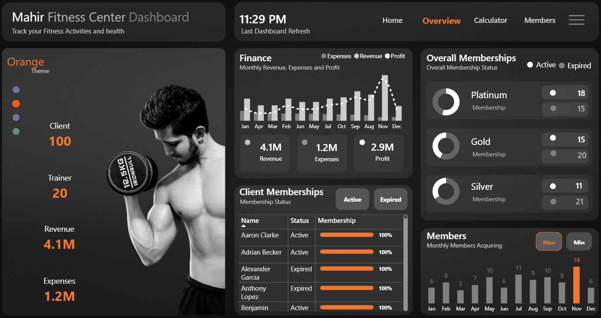
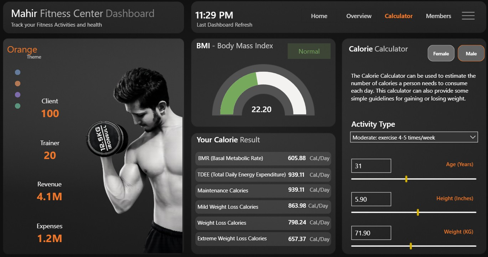
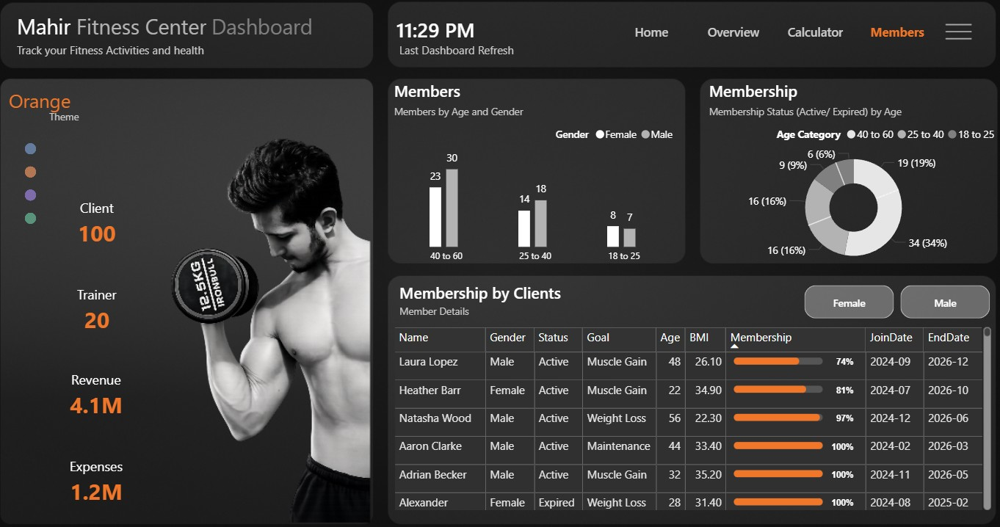

# Enterprise Fitness Center Business Intelligence & Health Analytics Simulator

## 🏋️‍♂️ Dashboard UI Portals
A multi-page, high-contrast dark mode operational dashboard framework built to optimize commercial gym management, track subscription lifecycles, monitor P&L cash flows, and provide interactive client biometric health simulators.

<p align="center">
  
  
</p>
<p align="center">
  
  
</p>

### 🔗 Public Interactive Link
* [👉 Click Here to Explore the Live Interactive Gym Analytics & Calculator Portfolio](YOUR_POWER_BI_SERVICE_OR_NOVYPRO_LINK_HERE) *

---

## 📈 Strategic Modules & Analytical Insights

### 1. Landing Portal & Brand Identity (`Gym_Home.jpg`)
* **Purpose:** A clean, high-impact user experience entry point using modern design layouts to route operations personnel seamlessly into distinct metric tracks via responsive navigation buttons.

### 2. Operational & Financial Core (`Gym_Overview.jpg`)
* **Membership Scale:** Manages an active roster of **100 Core Clients** supported by **20 Certified Personal Trainers**.
* **P&L Financial Performance:** Tracks **$4.1M in Total Gross Revenue** against **$1.2M in Operating Expenses**, yielding a strong net profit baseline of **$2.9M**.
* **Subscription Inflow Funnel:** Groups revenue generation across tiered categories (**Platinum: 18 active**, **Gold: 15 active**, and **Silver: 11 active**), complete with an interactive table tracking individual subscription renewal states.

### 3. Demographics & Membership Churn (`Gym_Members.jpg`)
* **Age & Gender Distributions:** Segregates membership volume into age blocks, showing that the **40–60 Age Cohort (30 Male / 23 Female)** represents the core business foundation.
* **Biometric Profile Aggregations:** Features a granular matrix tracking individual client goals (e.g., Muscle Gain, Weight Loss, Maintenance) against active membership timelines and real-time BMI ratings.

### 4. Interactive Biometric Simulator (`Gym_Calculator.jpg`)
* **What-If Parameter Infrastructure:** Features a client wellness workstation. By moving sliders for **Age**, **Height (Inches)**, and **Weight (KG)**, and picking an **Activity Type** dropdown, the dashboard calculates physiological metrics on the fly.
* **Caloric Target Ranges:** Simulates exact metabolic requirements including **BMR (Basal Metabolic Rate)** and **TDEE (Total Daily Energy Expenditure)** to generate customized nutritional pathways (Maintenance, Mild Weight Loss, Extreme Weight Loss).

---

## 🛠️ Advanced ETL Ingestion & Schema Modeling
* **Star Schema Architecture:** Enforces optimized filter propagation by separating billing transactions and client biometric records (`Fact_Memberships`) from separate dimension lookups (`Dim_Dates`, `Dim_Trainers`, and `Dim_Biometrics`).
* **Biometric Parameter Logic:** Engineered decoupled what-if parameter tables to capture user variable overrides without cross-filtering or corrupting the historical database rows.

### Centralized Explicit DAX Engineering

#### Algorithmic TDEE Calorie Calculator Matrix
```dax
TDEE Value = 
VAR CalculatedBMR = [BMR Value]
VAR ActivityMultiplier = 
    SELECTEDVALUE('Dim_Activity'[Multiplier], 1.2) // Defaults to Sedentary if unselected
RETURN
CalculatedBMR * ActivityMultiplier
